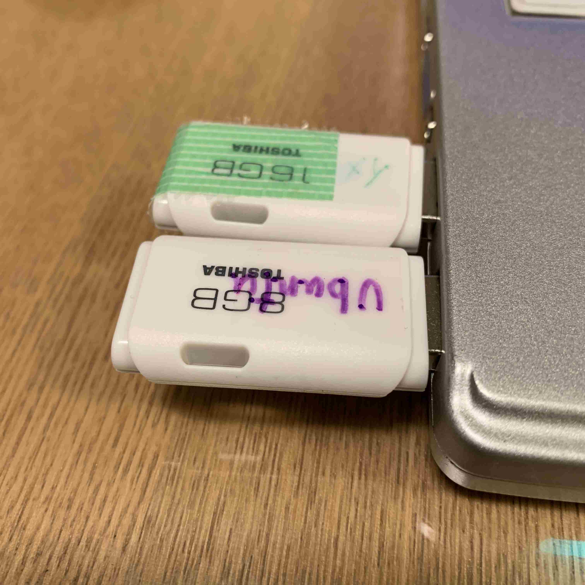
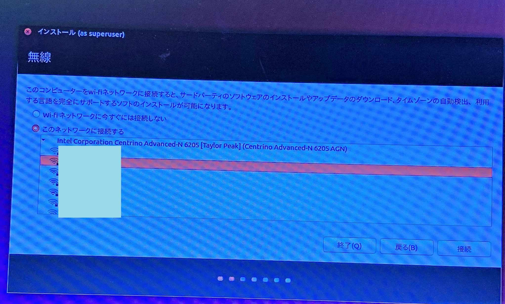
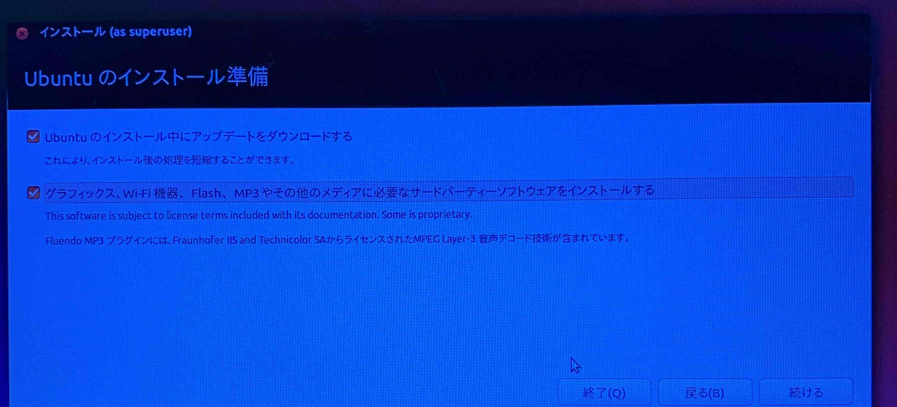
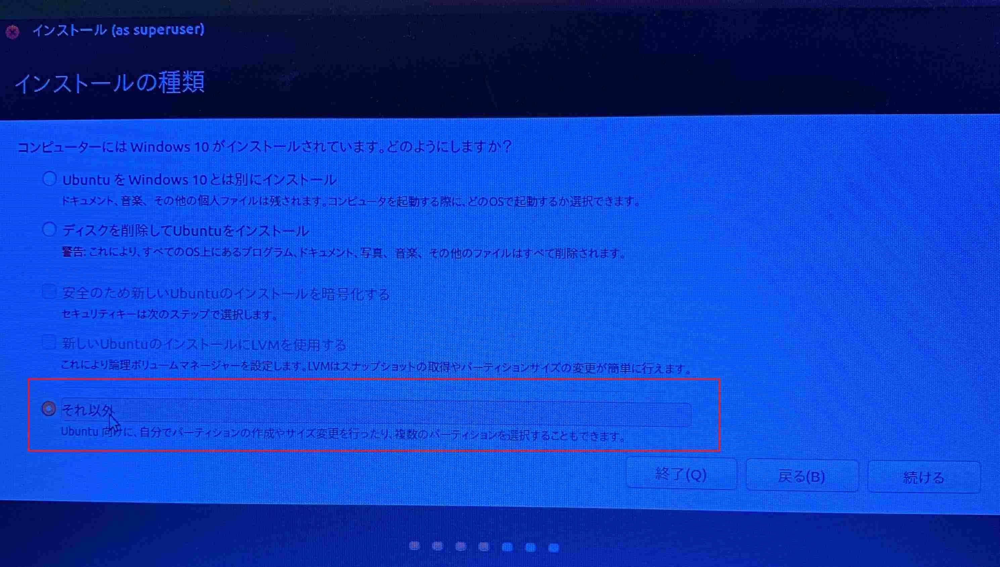
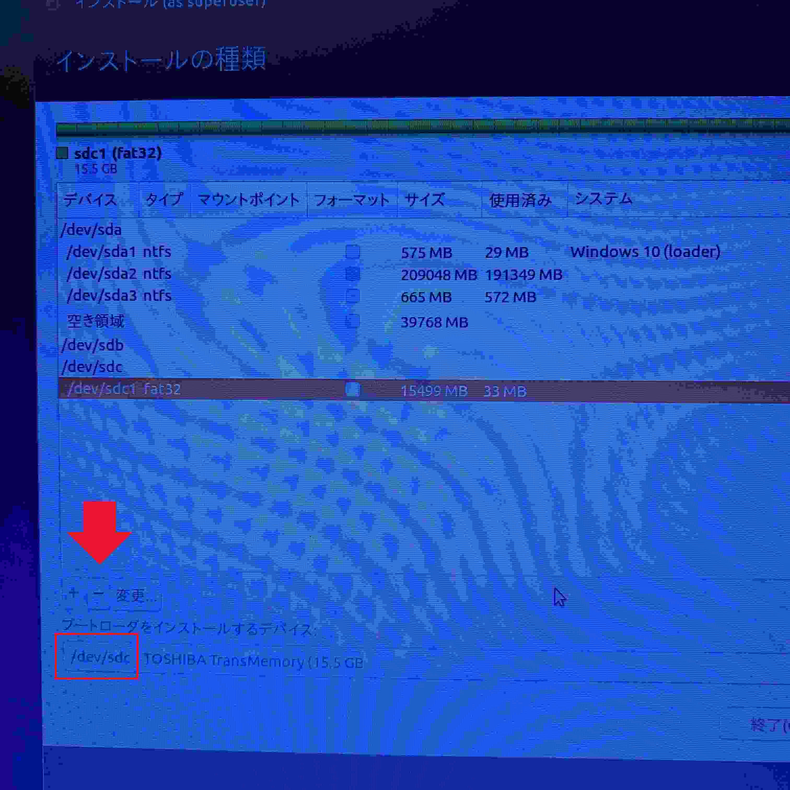
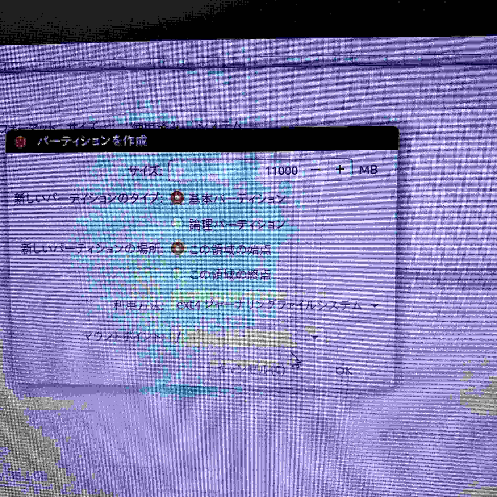
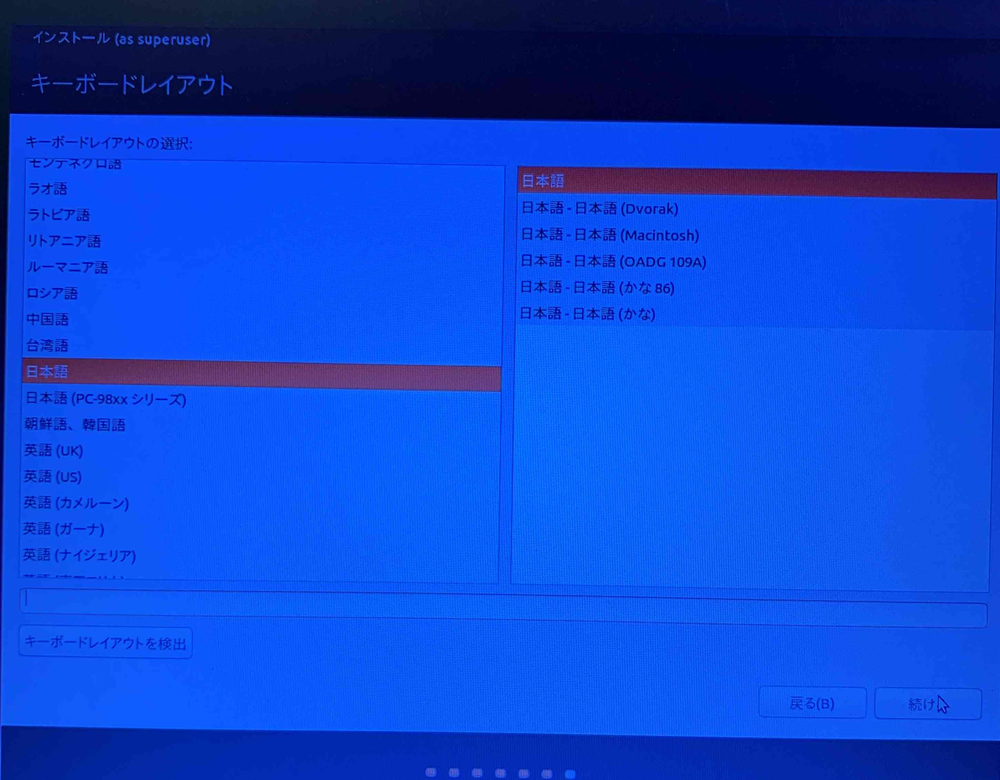
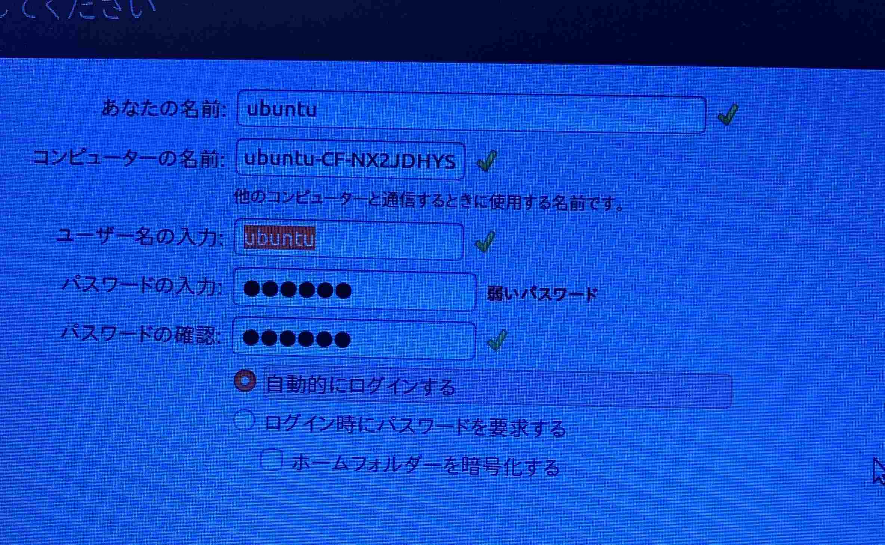

# USBメモリもしくはUSB-HDDでつくるROS kinetic開発環境
## 概要
ROS開発環境にはUbuntuを使うのが一般的だ。
Ubuntuのインストールはとても簡単にできる。しかし、WindowsがすでにインストールされているPCに、Ubuntuを共存させてインストールするのは、慣れないとデータ消失のリスクが伴う。

専用PCを準備するのが最も確実な方法ではある。しかしそれ以外の方法として、USBメモリもしくはUSB-HDDからUbuntuを起動させる方法を紹介したい。

USBメモリもしくはUSB-HDDからUbuntuを起動する方法はいくつかある。

1. [USBメモリもしくはUSB-HDDにUbuntuを直接インストールする方法](#usbメモリusb-hdd等に直接インストールする方法)
2. [Live USB Imageを使う方法](#live-usb-imageを使う方法)

1.の方法をとる場合、USBメモリを使うのではなく、USB-HDDやUSB-SSDなどを使うとよい。
USBメモリはランダムアクセスが遅いことが多い。また、書き込み回数に上限があり、頻繁な書き込みによって、データの破損などが発生する可能性がある。

2.の方法は、基本的には読み込み専用とし、設定ファイルや作業ディレクトリのみを書き込むことで、USBメモリでもある程度快適に作業ができ、データの破損のリスクを下げている。
そのためには、ROSなど必要なパッケージをあらかじめインストールされたImageを作成する必要がある。（小さなパッケージは後から追加できる。）


# USBメモリ(USB-HDD等)に直接インストールする方法
## インストールメディア（USBメモリ）を作成する
一般的なUSBメモリを準備する。4GBあれば足りる。

[Ubuntu 16.04](http://releases.ubuntu.com/16.04/)から、ISOイメージファイルをダウンロードする。`64-bit PC (AMD64) desktop image`が一般的なPCで使われるイメージファイルである。

次に、ISOファイルをUSBメモリに書き込む。これには専用のソフトウェアが必要である。
[Rufus](https://rufus.ie/)などがある。

## インストーラーを実行する


PCの電源を切り、うえで作ったインストールメディア（USBメモリ）と、インストール先のUSBメモリもしくはUSB-HDDをPCに接続する。
インストール先は、16GB以上の容量が必要である。

インストーラーが起動する。

ここで、インストーラーが起動しない場合、USBから起動する設定になっていない可能性がある。
BIOSの設定画面に入り、起動順番でUSBが先頭になるようにする。（この設定方法はPCによって異なる）


Ubuntuをインストールをクリックする




WiFiの接続を促されるので、接続しておく。




これらの選択肢はどちらでも良い。




インストールの種類では、必ず「それ以外」を選ぶ。上2つを選ぶとPC本体のWindows環境に影響が及ぶ可能性がある。




パーティションの一覧が表示される。

すでにWindowsがインストールされているPCの場合、上記のように本体のHDDが表示される。通常、一番上に表示されているパーティション（この例では`/dev/sda`）は、本体内蔵HDDである。
USBメモリやUSB-HDDは一番下に表示される場合が多い。タイプ（この例では`fat32`）とサイズも確認して、インストール先のデバイス名を確認しておく。この例では`/dev/sdc`がインストール先である。

まず最初に、一番下の「ブートローダーをインストールするデバイス」で、インストール先のUSBメモリを選ぶ。
ここを間違えると、本体のHDDにブートローダーが入ってしまうので注意する。

次に、インストール先に、すでにあるパーティションを削除する。
上の例では、`/dev/sdc1`をクリックし、「ー」ボタンを押す。



次に「＋」ボタンを押す。Ubuntuをインストールする領域を作成する。
サイズは10GB以上の十分なサイズとする。ただし、次の工程でスワップ領域でメモリの倍程度の容量を使用するので、その分を残しておく。
例えば、32GBのUSBメモリで、本体メモリが4GBの場合、24GBをこのパーティションに割り当て、8GBを次の工程でスワップ領域に割り当てる。
ここでのマウントポイントは「/」とする。


次に、再度「＋」を押し、スワップ領域を作成する。サイズはメモリの倍程度のサイズとし、利用方法として、「スワップ領域」を選択する。
サイズについては、「/」パーティションの容量を10GB以上にするのが優先で、こちらは少なくなってもよい。


パーティションが上図のようになっていればOKである。

あらためて、「ブートローダーをインストールするデバイス」で、USBメモリが選ばれているか確認する。(この例では/dev/sdc）


インストールをクリックする


続けるをクリックする。


Tokyoを選ぶ



日本語ー日本語を選ぶ



ユーザー名とパスワードを入力する。


あとはインストールが完了するのを待つ。

再起動して、インストーラーが入ったUSBを抜き、インストールが完了したUSBをさしておくと、Ubuntuが起動する。


# Live USB Imageを使う方法
## カスタムイメージの作成方法
[Cubic](https://launchpad.net/cubic)というソフトウェアを使う。
このソフトウェアは、Ubuntuなどの公式イメージをカスタマイズし、オリジナルのLive USBイメージを作成することができる。
このソフトウェアはUbuntu上で動作する。（残念ながらWindows環境だけでカスタムイメージを作成することはできない。イメージを作成できる環境の人に作成をしてもらい、それを配布してもらうのが現実的だろう）
- 参考[How To Customize Ubuntu Or Linux Mint Live ISO With Cubic](https://www.linuxuprising.com/2018/07/how-to-customize-ubuntu-or-linux-mint.html)
- 参考[How to create a custom Ubuntu ISO with Cubic](https://www.techrepublic.com/article/how-to-create-a-custom-ubuntu-iso-with-cubic/)

### Cubicをインストール
```
sudo apt-add-repository ppa:cubic-wizard/release
sudo apt-key adv --keyserver keyserver.ubuntu.com --recv-keys 6494C6D6997C215E
sudo apt update
sudo apt install cubic
```

### カスタムイメージを作成
ここでは、[Lubuntu 16.04.6](http://cdimage.ubuntu.com/lubuntu/releases/16.04.6/release/)の「64-bit PC (AMD64) desktop image」をベースとした。
Lubuntuを使った理由は、イメージのサイズが小さいということと、RAM使用量が少ないということである。
Live USBではスワップ領域を確保できないためRAMの使用量を気にする必要がある。

下記の手順で行う。
#### 1. Project Directory を指定する。（10GB程度の容量が必要とされる）→Nextをクリック
#### 2. Original ISOを指定する。(上記でダウンロードしたISOファイル）→Nextをクリック
#### 3. Shellが開くので必要なパッケージをインストールする。root環境なのでsudoは不要。下記のコマンドを実行する。すべて終わったらNextをクリック
```
apt update
apt upgrade

sh -c 'echo "deb http://packages.ros.org/ros/ubuntu $(lsb_release -sc) main" > /etc/apt/sources.list.d/ros-latest.list'
apt-key adv --keyserver 'hkp://keyserver.ubuntu.com:80' --recv-key C1CF6E31E6BADE8868B172B4F42ED6FBAB17C654
apt update

apt install ros-kinetic-desktop-full

apt install python-pip

#pipでエラーがでるのでLocaleを設定している
export LC_ALL=$LC_NAME

pip install requests flask
apt-get install ros-kinetic-turtlebot3 ros-kinetic-turtlebot3-msgs ros-kinetic-turtlebot3-simulations ros-kinetic-aruco-ros

#必要になりそうなパッケージを一通りインストール
apt-get install ros-kinetic-joy ros-kinetic-teleop-twist-joy ros-kinetic-teleop-twist-keyboard ros-kinetic-laser-proc ros-kinetic-rgbd-launch ros-kinetic-depthimage-to-laserscan  ros-kinetic-rosserial-arduino ros-kinetic-rosserial-python ros-kinetic-rosserial-server ros-kinetic-rosserial-client ros-kinetic-rosserial-msgs ros-kinetic-amcl ros-kinetic-map-server ros-kinetic-move-base ros-kinetic-urdf ros-kinetic-xacro ros-kinetic-compressed-image-transport ros-kinetic-rqt-image-view ros-kinetic-gmapping ros-kinetic-navigation ros-kinetic-interactive-markers ros-kinetic-slam-gmapping ros-kinetic-libg2o libopencv-dev ros-kinetic-costmap-converter libsuitesparse-dev libarmadillo-dev libarmadillo6 graphviz graphviz-dev ros-kinetic-jsk-rviz-plugins ros-kinetic-smach* gnome-terminal
pip install transitions pygraphviz

# デフォルトのタイムゾーンを東京に
dpkg-reconfigure tzdata
# Asia/Tokyo を選ぶ

# ハードウェア時計がローカルタイムを示すように設定(参考:http://manpages.ubuntu.com/manpages/bionic/ja/man8/hwclock.8.html )
# Windowsとの共存のために必要な設定
cat << EOF | tee --append /etc/adjtime
0.0 0 0
0
LOCAL
EOF

# 日本語環境をインストール 
apt install language-pack-ja
update-locale LANG=ja_JP.UTF-8
apt install fcitx-mozc

# キーボードを日本語設定
dpkg-reconfigure keyboard-configuration
# Generic 105-key (Intel) PC > Japanese > Japanese > The default for the keyboard layout > No compose key

# Visual Studio Codeをインストール
curl https://packages.microsoft.com/keys/microsoft.asc | gpg --dearmor > microsoft.gpg
install -o root -g root -m 644 microsoft.gpg /etc/apt/trusted.gpg.d/
sh -c 'echo "deb [arch=amd64] https://packages.microsoft.com/repos/vscode stable main" > /etc/apt/sources.list.d/vscode.list'
apt update
apt install code
```
#### 4. Nextをクリック
#### 5. kernelの選択などの画面になるが、特に変更せずGenerateをクリック
#### 6. ISOの生成が始まる。数分かかる。
#### 7. Finishを押して完了

## イメージの書き込み
イメージの書き込みはWindowsでも行える。（Linuxでも行える）
[UNetbootin](https://unetbootin.github.io/)を使用する。
USBメモリをPCに接続する。FAT32でフォーマットをする。必ずFAT32でなければならない。
1. ディスクイメージを選択し、...をクリックして、上記で生成したISOを選択
2. そのすぐ下の「スペースは、・・・使用(Ubuntuのみ)」に4096(MB)と入力（4096MBはFAT32の制約からくる上限）
3. タイプ「USB ドライブ」ドライブを選択し、OKをクリック
（10分ほどかかります）
